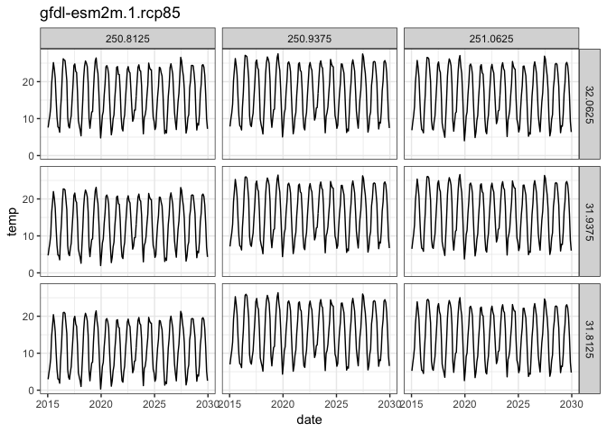

<!-- README.md is generated from README.Rmd. Please edit that file -->

# Portal Climate Projections

Using BCSD-CMIP5-Climate-monthly 1/8 degree downscaled data.

## R Package Setup

``` r
library(ncdf4)
library(tidyverse)
#> ── Attaching packages ─────────────────────────────────────────────────────────────────────────────────────────────────────────────── tidyverse 1.2.1 ──
#> ✔ ggplot2 3.1.0       ✔ purrr   0.3.0  
#> ✔ tibble  2.0.1       ✔ dplyr   0.8.0.1
#> ✔ tidyr   0.8.2       ✔ stringr 1.4.0  
#> ✔ readr   1.1.1       ✔ forcats 0.3.0
#> ── Conflicts ────────────────────────────────────────────────────────────────────────────────────────────────────────────────── tidyverse_conflicts() ──
#> ✖ dplyr::filter() masks stats::filter()
#> ✖ dplyr::lag()    masks stats::lag()
library(ggplot2)
```

## Reading in the data

Choose the variable we are going to read in

``` r
data_path <- "bcsd5"
variable <- "tas" # choices are "pr" - precipitation
#             "tasmin" - minimum temperature
#             "tasmin" - maximum temperature

data_files <- paste0("Extraction_", variable, ".nc")
dat <- nc_open(file.path(data_path, data_files[1]))
```

Get the dimensions of the dataset:

``` r
long_vec <- ncvar_get(dat, "longitude")
lat_vec <- ncvar_get(dat, "latitude")
date_vec <- ncvar_get(dat, "time") + as.Date("1950-01-01")
projections_vec <- read.table("bcsd5/Projections5.txt")[,1]
```

Retrieve the data and process it into long-form with just the model
projection desired:

``` r
data_multidim_array <- ncvar_get(dat, "tas")
model_idx <- 70
print(paste("Getting projection", projections_vec[model_idx]))
#> [1] "Getting projection gfdl-esm2m.1.rcp85"

dat <- data_multidim_array[,,,model_idx] %>%
    reshape2::melt() %>%
    as_tibble() %>%
    mutate(longitude = as.factor(long_vec[Var1]), 
           latitude = as.factor(lat_vec[Var2]), 
           date = date_vec[Var3], 
           temp = value) %>%
    select(date, latitude, longitude, temp)
```

## Plot the temperature time series

Note we reverse the order of levels for latitude, so that the grid is
formatted with South at the bottom of the figure.

``` r
dat %>%
    mutate(latitude = fct_rev(latitude)) %>%
    filter(date > as.Date("2015-01-01"), 
           date < as.Date("2030-01-01")) %>%
    ggplot(aes(x = date, y = temp)) + 
    facet_grid(latitude ~ longitude) + 
    geom_line() + 
    labs(title = projections_vec[model_idx]) + 
    theme_bw()
```

<!-- -->
